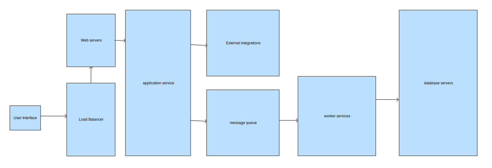

**High-Level Architectural Diagram:**

**Components and Interactions:**

1. **User Interface (UI):** The user interacts with the system through a web or mobile application, which allows fund managers to create and manage investment pools and investors to participate.

2. **Web Server:** A web server handles client requests and routes them to appropriate components.

3. **Application Layer:** This layer consists of the following components:
   - **Authentication & Authorization:** Manages user authentication and ensures secure access to the system.
   - **Investment Pool Management:** Manages the creation, modification, and distribution of investment pools.
   - **Real-Time Updates:** Handles real-time updates of investment amounts and transactions.
   - **Database Access:** Interacts with the database to retrieve and store data.

4. **Database:** A relational or NoSQL database stores user data, investment pool details, transactions, and investor information.

5. **Message Queues:** Used for asynchronous processing of real-time updates and notifications.

6. **External Services:** Interfaces with external services like payment gateways and financial APIs for transactions and financial data.

7. **Security & Compliance:** Implements security measures, encryption, and compliance controls to protect sensitive financial information.

8. **Scalability & Load Balancing:** To ensure scalability, components can be deployed across multiple servers and load balancers distribute traffic.

9. **Monitoring & Logging:** Monitors system performance and logs events for troubleshooting and auditing.

**Technologies and Tools:**

1. **Web Server:** Nginx or Apache for web server functionality.

2. **Application Layer:** Node.js, Python, or Java for backend development. Frameworks like Express, Flask, or Spring Boot for application development.

3. **Database:** PostgreSQL, MySQL, or MongoDB for data storage.

4. **Message Queues:** RabbitMQ or Apache Kafka for real-time updates.

5. **External Services:** Stripe or PayPal for payment processing, and financial APIs for data retrieval.

6. **Security & Compliance:** Implement TLS/SSL for data encryption, OAuth2 for authentication, and regular security audits and compliance checks.

7. **Scalability & Load Balancing:** Kubernetes for container orchestration, Docker for containerization, and NGINX or HAProxy for load balancing.

8. **Monitoring & Logging:** Prometheus for monitoring, ELK stack (Elasticsearch, Logstash, Kibana) for logging and analysis.

**Potential Bottlenecks and Strategies:**

- **Database Bottlenecks:** As the number of transactions grows, the database can become a bottleneck. Implement database sharding, caching mechanisms, and use a highly scalable database system like AWS RDS or Google Cloud Spanner.

- **Real-Time Updates:** Implement a message queue system to handle real-time updates asynchronously, reducing the load on the main application server.

- **Security Concerns:** Regularly update and patch all components, conduct security audits, and follow industry best practices for securing financial data.

**Remote-First Implementation and Deployment:**

1. **Team Collaboration:** Facilitate effective collaboration using remote project management and communication tools (e.g., Slack, Jira, Zoom).

2. **Version Control:** Use Git for version control, hosted on platforms like GitHub or GitLab.

3. **Continuous Integration/Continuous Deployment (CI/CD):** Set up CI/CD pipelines (e.g., Jenkins, GitLab CI) for automated testing and deployment.

4. **Remote Server Management:** Use Infrastructure as Code (IaC) tools like Terraform or AWS CloudFormation to provision and manage remote server infrastructure.

5. **Security Measures:** Ensure secure remote access to servers via VPNs or secure connections. Implement access control and regular security audits.

6. **Training and Support:** Provide remote training and support to team members and end-users via online tutorials, documentation, and help desk systems.

7. **Monitoring and Alerting:** Set up remote monitoring and alerting systems to ensure the health and performance of the application and infrastructure.

8. **Documentation:** Maintain thorough documentation for the architecture, APIs, and deployment procedures to aid remote team members and future updates.
